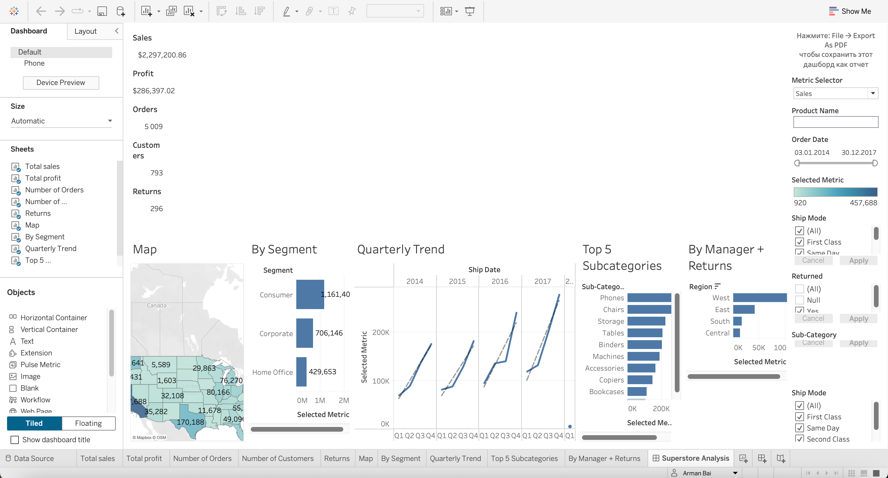

# Tableau Dashboard — Superstore Sales Analysis

Этот проект выполнен в Tableau и представляет собой дашборд для анализа продаж, прибыли, возвратов и поведения клиентов розничной сети (Superstore).

📊 Ссылка на опубликованный дашборд:  
🔗 [Tableau Public — Superstore Dashboard](https://public.tableau.com/app/profile/arman.bai4246/viz/64_17470606204810/SuperstoreAnalysis?publish=yes)

## 🧠 Ключевые метрики:
- **Sales**, **Profit**, **Orders**, **Customers**, **Returns**
- Анализ по сегментам: Consumer, Corporate, Home Office
- Тренды по кварталам
- Геоанализ (карта США)
- ТОП-5 подкатегорий товаров
- Возвраты по менеджерам

## 🛠 Используемые инструменты:
- Фильтры: даты, категории, возвраты, метрики
- Кастомизация: выбор метрики (Metric Selector)
- Карта с кластеризацией по регионам
- Интерактивность: фильтры применяются ко всем виджетам

## 📸 Визуализация

## 👤 Автор:
**Arman Bai**  
Tableau Developer | Data Analyst  
🔗 [LinkedIn](https://www.linkedin.com/in/arman-baigudtinov-23a08a93)
